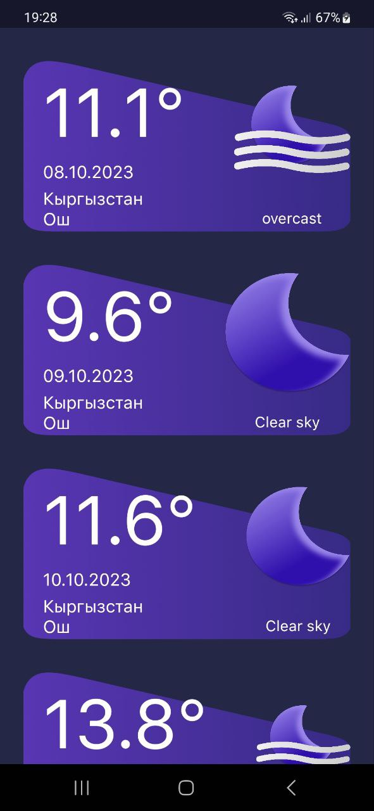
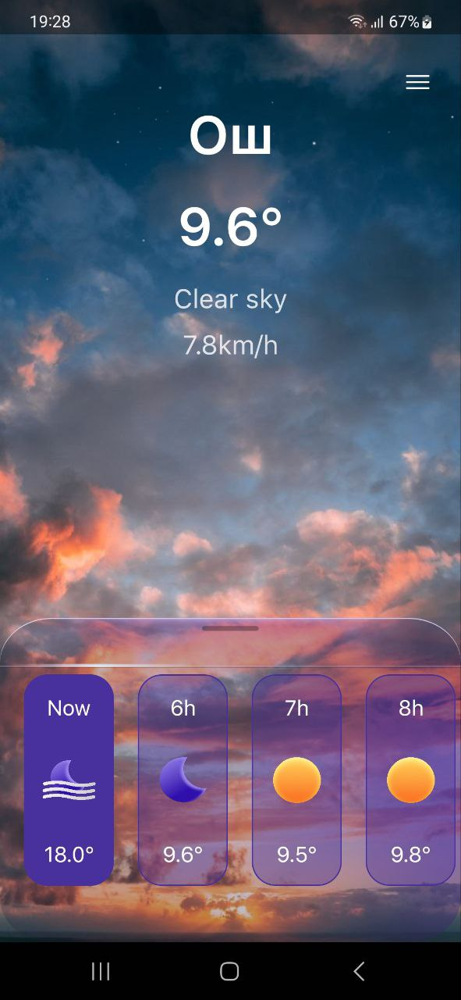

# A program written entirely in Kotlin using the principles of Clean Architecture according to the MVVM pattern.

Application for viewing current weather and 16 days. Written in Kotlin using the Jetpack Compose
framework.
Using the
server (https://open-meteo.com/en/docs#hourly=temperature_2m&daily=&timezone=GMT&forecast_days=1)

## Screenshots

## Libraries

* [Jetpack Compose](https://developer.android.com/jetpack/compose) Jetpack Compose is Android’s
  recommended modern toolkit for building native UI. It simplifies and accelerates UI development on
  Android. Quickly bring your app to life with less code, powerful tools, and intuitive Kotlin APIs.

* [Kotlin flows](https://developer.android.com/kotlin/flow) In coroutines, a flow is a type that can
  emit multiple values sequentially, as opposed to suspend functions that return only a single
  value. For example, you can use a flow to receive live updates from a database.

* [Kotlin Coroutines](https://github.com/Kotlin/kotlinx.coroutines) Coroutines is a rich library for
  coroutines developed by JetBrains. It contains a number of high-level primitives with support for
  coroutines, which are discussed in this guide, including startup, asynchrony, and others.

* [ViewModel](https://developer.android.com/topic/libraries/architecture/viewmodel) Data related to
  the user interface that is not destroyed when the application is rotated. Easily schedule
  asynchronous tasks for optimal execution.

* [Lifecycle](https://developer.android.com/topic/libraries/architecture/lifecycle) An interface
  that automatically responds to lifecycle events.

* [Room](https://developer.android.com/jetpack/androidx/releases/room) The Room persistence library
  provides an abstraction layer over SQLite to allow for more robust database access while
  harnessing the full power of SQLite.

* [Location](https://developer.android.com/training/location/retrieve-current)Get the last known
  location
  Using the Google Play services location APIs, your app can request the last known location of the
  user's device.
  In most cases, you are interested in the user's current location,
  which is usually equivalent to the last known location of the device.

* [Hilt](https://developer.android.com/training/dependency-injection/hilt-android)Hilt is a
  dependency injection library for Android that reduces the boilerplate of doing manual dependency
  injection in your project. Doing manual dependency injection requires you to construct every class
  and its dependencies by hand, and to use containers to reuse and manage dependencies.

* [Retrofit](https://www.geeksforgeeks.org/retrofit-with-kotlin-coroutine-in-android/)Retrofit is a
  type-safe http client which is used to retrieve, update and delete the data from web services.
  Nowadays retrofit library is popular among the developers to use the API key. The Kotlin team
  defines coroutines as “lightweight threads”. They are sort of tasks that the actual threads can
  execute. Coroutines were added to Kotlin in version 1.3 and are based on established concepts from
  other languages. Kotlin coroutines introduce a new style of concurrency that can be used on
  Android to simplify async code. In this article, we will learn about retrofit using Kotlin
  coroutine. So we will be using Retrofit for network requests. Retrofit is a very popular library
  used for working APIs and very commonly used as well. We will learn it by making a simple app
  using an API to get some data using Retrofit.